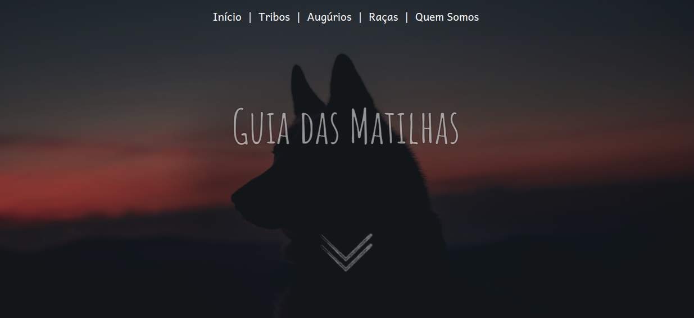
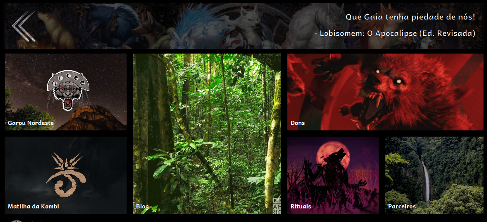

<h1 align="center">Guia das Matilhas</h1>

Projeto idealizado por Thiago Lucas Martins da Silva e desenvolvido por Bruno Gabryell Cabral da Silva com o intuito de criar uma aplicação que facilite o acesso a informações voltadas ao jogo de RPG <strong>Lobisomem: O Apocalipse</strong>!

<h3 align="center">https://brunocabralsilva.github.io/guia-das-matilhas/</h3>

<h3> Índice</h3>

* [Introdução](#intro)
* [Descrição do Projeto](#descrição-do-projeto)
* [Funcionalidades e Demonstração da Aplicação](#funcionalidades-e-demonstração-da-aplicação)
* [Tecnologias utilizadas](#tecnologias-utilizadas)
* [Pessoas Contribuidoras](#pessoas-contribuidoras)
* [Pessoas Desenvolvedoras do Projeto](#pessoas-desenvolvedoras)
* [Licença](#licença)
* [Conclusão](#conclusão)

<h2 id="intro">Introdução</h2>

Role-playing game, também conhecido como RPG, é um tipo de jogo em que os jogadores assumem papéis de personagens e criam narrativas de forma geralmente colaborativas. O progresso de um jogo se dá de acordo com um sistema de regras predeterminado, dentro das quais os jogadores podem improvisar livremente. É aí que entra o sistema de RPG <strong>World of Darkness</strong>.

<strong>World of Darkness</strong> é nome dado a dois universos ficcionais relacionados, mas distintos, criados como configurações de campanha para role-playing games de horror originalmente da editora estadunidense White Wolf. O primeiro foi concebido por Mark Rein-Hagen, enquanto o segundo foi projetado por várias pessoas da White Wolf Gaming Studio, que Rein-Hagen ajudou a criar.

Dentro do World of Darkness o jogo de <strong>Lobisomem: O Apocalipse</strong> é um dos muitos jogos existentes e possíveis existentes na franquia, tendo sido este publicado no Brasil pela Devir Livraria. É um dos mais conhecidos títulos da série e usa o sistema Storyteller para o desenvolvimento e a interpretação dos fatos e eventos.

Por existirem mais de cem livros de Lobisomem: O Apocalipse como resultado de complementos das versões básicas do cenário, fica difícil ou no mínimo moroso pesquisar por entre estes informações a serem adicionadas nas fichas de cada personagem. Visando este déficit, decidimos criar uma aplicação que concede muitas destas informações de forma prática e rápida, auxiliando os jogadores de maneira mais que efetiva!
