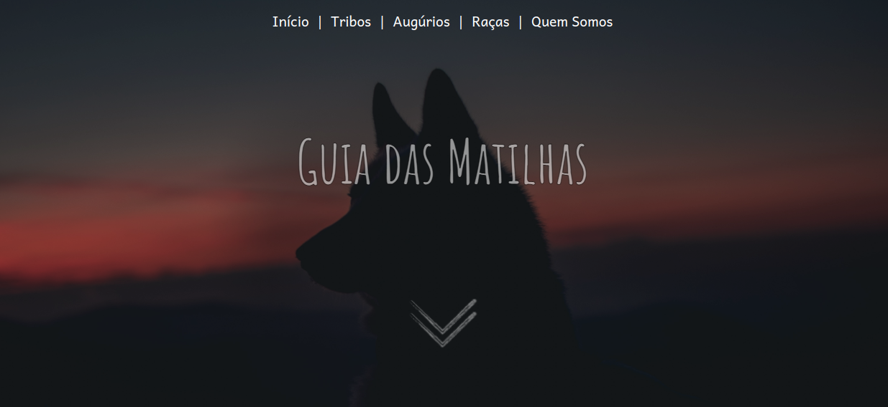

<h1 align="center">Guia das Matilhas</h1>

Projeto idealizado por Thiago Lucas Martins da Silva e desenvolvido por Bruno Gabryell Cabral da Silva com o intuito de criar uma aplicação que facilite o acesso a informações voltadas ao jogo de RPG <strong>Lobisomem: O Apocalipse</strong>!

<h3 align="center">https://brunocabralsilva.github.io/guia-das-matilhas/</h3>

<h2> Índice</h2>

* [Introdução](#intro)
* [Descrição do Projeto](#descrição-do-projeto)
* [Mapeamento do Site](#mapeamento)
* [Tecnologias utilizadas](#tecnologias-utilizadas)
* [Desenvolvedores e demais contribuidores](#pessoas-envolvidas)
* [Conclusão](#conclusão)

<h2 id="intro">Introdução</h2>

Role-playing game, também conhecido como RPG, é um tipo de jogo em que os jogadores assumem papéis de personagens e criam narrativas geralmente colaborativas. O progresso de um jogo se dá de acordo com um sistema de regras predeterminado, dentro das quais os jogadores podem improvisar livremente. É aí que entra o sistema de RPG <strong>World of Darkness</strong>.

<strong>World of Darkness</strong> é nome dado a dois universos ficcionais relacionados, mas distintos, criados como configurações de campanha para role-playing games de horror originalmente da editora estadunidense White Wolf. O primeiro foi concebido por Mark Rein-Hagen, enquanto o segundo foi projetado por várias pessoas da White Wolf Gaming Studio, que Rein-Hagen ajudou a criar.

Dentro do <strong>World of Darkness</strong> o jogo de <strong>Lobisomem: O Apocalipse</strong> é um dos muitos jogos possíveis e existentes na franquia, tendo sido este publicado no Brasil pela Devir Livraria. É um dos mais conhecidos títulos da série e usa o sistema Storyteller para o desenvolvimento e a interpretação dos fatos e eventos.

Por existir uma quantidade enorme de livros de <strong>Lobisomem: O Apocalipse</strong> como resultado de complementos das versões básicas do cenário, fica difícil ou no mínimo moroso pesquisar por entre estes informações a serem adicionadas nas fichas de cada personagem. Visando este déficit, decidimos criar uma aplicação que ajude nessas buscas, economizando tempo dos jogadores e auxiliando de forma eficaz em encontrar as informações requeridas.

<h2 id="descrição-do-projeto">Descrição do Projeto</h2>

O Guia das Matilhas é um projeto onde, por meio de pouquíssimo ou quase nenhum esforço, o usuário poderá encontrar listas de dons, fetiches, rituais, entre outras informações, podendo filtrá-las para visualizar apenas o que busca.

<h2 id="mapeamento">Mapeamento do site </h2>

<ol>
<li><h4>Menu Principal</h4></li> 

Lugar de acesso a diversas das informações do site. Por meio desta página, é possível ser direcionado para as páginas Dons, Admin, Fetiches, Parceiros, Garou Nordeste e Matilha da Kombi.

 

<li><h4>Dons</h4></li> 

Na página é possível encontrar uma breve descrição do que são os dons, além de ser possível utilizar os filtros de busca, que podem ser maximixados para que se escolham itens de cada lista. As aludidas listas são cinco:

<ul>
<li>Raça;</li>
<li>Tribo;</li>
<li>Augúrio;</li>
<li>Posto;</li>
<li>Livro.</li>
</ul>
 

Ao clicar uma vez, o item da lista selecionado é adicionado e pode ser visualizado em um pop-up no canto superior direito da tela. Ele pode ser removido clicando novamente no ícone ou desmarcando o checkbox referente ao mesmo no pop-up.

Ao clicar em buscar, a aplicação retorna uma lista com todos os dons que se adequam aos filtros selecionados.

<li><h4>Rituais</h4></li>

 Área do site ainda em processo de construção.

<li><h4>Fetiches</h4></li>

 Área do site ainda em processo de construção.

<li><h4>Parceiros</h4></li>

Nesta página é disponibilizada uma lista de todos os parceiros dos grupos ao qual os desenvolvedores pertencem ou possuem uma grande proximidade. É possível encontrar todos os links de contato com estes parceiros, além de uma breve descrição dos mesmos e uma imagem da logo que os representa.

<li><h4>Garou Nordeste</h4></li>

 Área do site ainda em processo de construção.

<li><h4>Matilha da Kombi</h4></li>

 Área do site ainda em processo de construção.

<li><h4>Tribos</h4></li>

 Área do site onde são disponibilizadas as dezessete tribos para consulta. Em uma lista no formato carrossel, o usuário poderá navegar entre as imagens de cada tribo, além de, no futuro, ter acesso a informações sobre a tribo ao clicar em uma delas.

<li><h4>Augúrios</h4></li>

 Área do site onde são disponibilizados os cinco Augúrios para consulta. Em uma lista no formato carrossel, o usuário poderá navegar entre as imagens de cada augúrio, além de, no futuro, ter acesso a informações ao clicar em uma delas.

<li><h4>Raças</h4></li>

 Área do site onde são disponibilizadas as três raças para consulta. Em uma lista no formato carrossel, o usuário poderá navegar entre as imagens de cada raça, além de, no futuro, ter acesso a informações e pontos de vista dos autores ao clicar em um deles.

<li><h4>Quem Somos</h4></li>

 Lugar reservado para falarmos um pouco a respeito de quem somos, quem são nossos grupos e como tudo começou, além de serem compartilhados todos os nossos links de contato.

<li><h4>Login (Fluxo Administrador)</h4></li>

 Um usuário administrador poderá acessar as funcionalidades referentes a sua função clicando em "Admin", na página de Menu. Ele será direcionado para uma página de Login que, antes de mais nada, verificará se ele possui um token de validação salvo em seu local storage no navegador. Caso exista e seja válido, o usuário é automaticamente direcionado para página do painel administrativo. Caso não, é necessário fazer o login para prosseguir (ao realizar o login com sucesso, um token é gerado e salvo no local storage).

<li><h4>Painel Administrativo (Fluxo Administrador)</h4></li>

 Lugar reservado para falarmos um pouco a respeito de quem somos, quem são nossos grupos e como tudo começou, além de serem compartilhados todos os nossos links de contato.

<li><h4>Painel de Dons (Fluxo Administrador)</h4></li>

 Na página em questão, é possível Adicionar um novo dom e listá-los. Para adicionar um dom, o usuário precisa preencher todos os dados necessários, caso contrário não será possível registrar o mesmo no banco de dados. Dentre todas as validações, é necessário escolher um nome que não existe ainda no banco de dados, não existirem campos em branco além de "nota", entre outros.

 Ao Adicionar um dom, ele é imediatamente listado junto aos demais dons existentes na área "Listar Dons" da página. A partir desta área, o usuário administrador poderá excluir um dom ou editá-lo.

</ol>

<h2 id="tecnologias-utilizadas">Tecnologias utilizadas</h2>

* `HTML5`
* `CSS3`
* `Javascript (ECMAScript 2018)`
* `React (Context API, Router Dom, Icons)`
* `Framer Motion`
* `Tailwind CSS`
* `Node JS`
* `Express`
* `Mysql`
* `Deploy do Railway(Backend e Banco de Dados)`
* `Deploy do Gh Pages(Frontend)`
* `Font Awesome`

<h2 id="pessoas-envolvidas">Desenvolvedores e demais contribuidores</h2>

* <strong>Bruno Gabryell Cabral da Silva</strong> - idealizador e Desenvolvedor Web;
* <strong>Thiago Lucas Martins da Silva</strong> - Idealizador, Tradutor, transcritor de textos e principal responsável por inserir dados na aplicação;
* <strong>Erika Emanuelly da Silva Cruz</strong> - Experiência do Usuário;
* <strong>Patrick Cosme de Oliveira</strong> - Experiência do Usuário;

<h2 id="conclusão">Conclusão</h2>

Programar é um eterno aprendizado. Quanto mais se pratica, mais se melhora. Praticar conceitos de programação com coisas que se é apaixonado apimenta ainda mais a relação! Muitos aprendizados novos são adicionados a cada dia, fazendo com que este projeto já tenha valido a pena antes mesmo de ser concluído!

